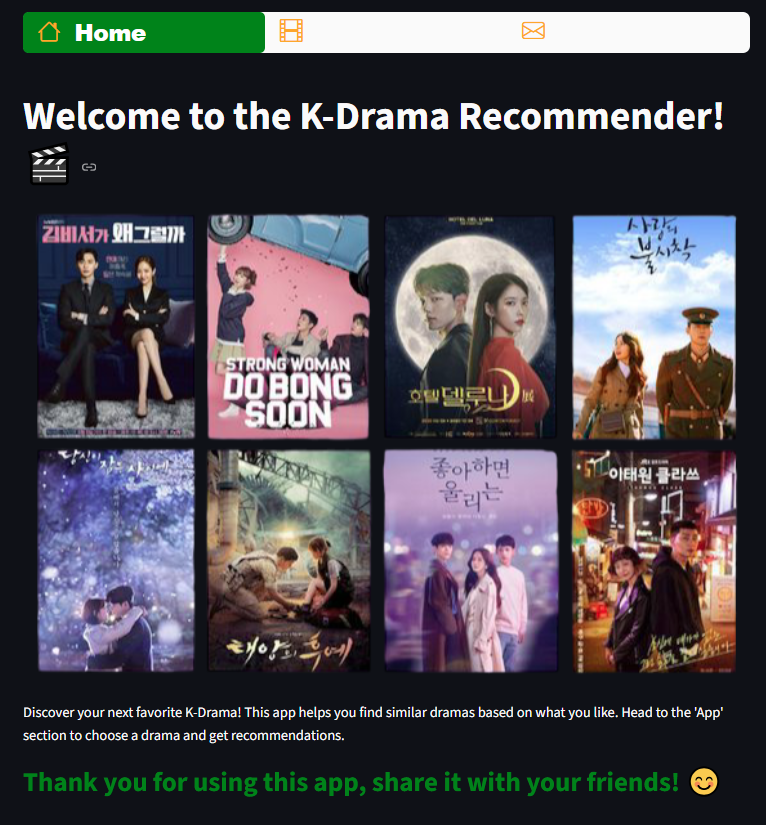
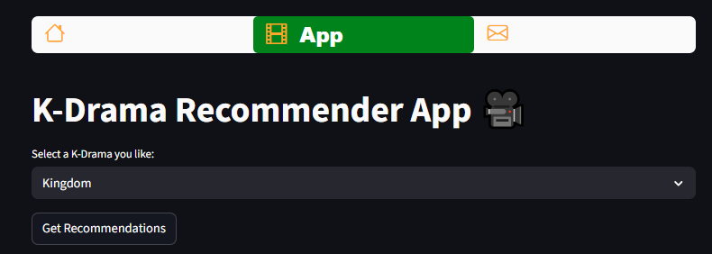
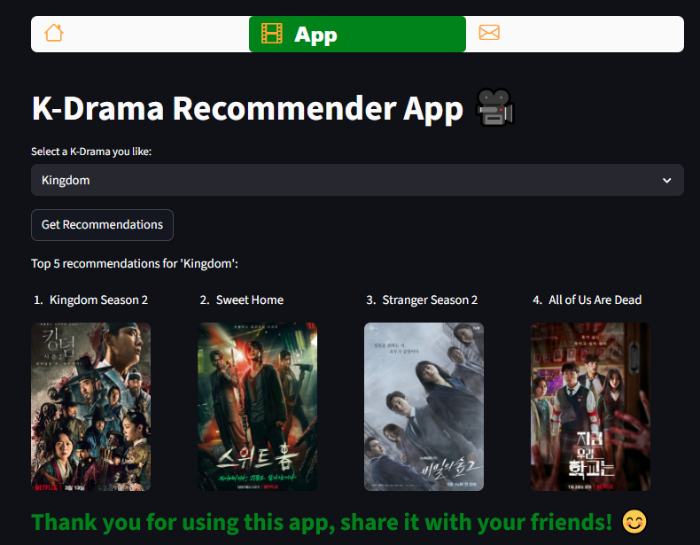
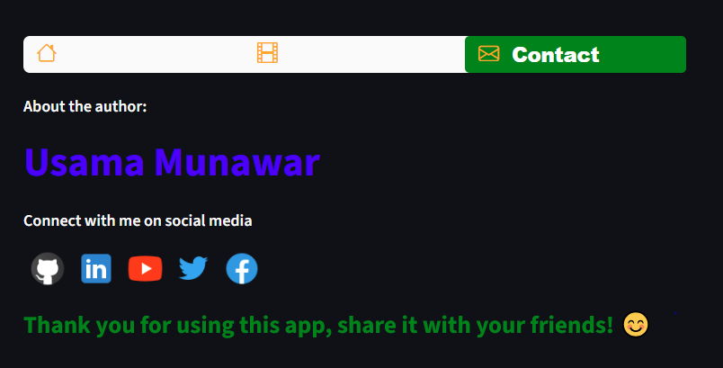

# 🎬 K-Drama Recommender Web-App

Welcome to the **K-Drama Recommender Web-App**! 🚀
This application helps you discover new Korean dramas based on your favorite shows.
Using **machine learning** and **content-based filtering**, the system recommends dramas similar to the one you select — all inside a clean and interactive **Streamlit** interface.

---

## 🎥 Demo

Here’s a quick look at the system in action 👇

---
## Dataset Overview 🌟

The recommender system uses a dataset of Korean dramas containing key information such as:

* **Name** – Title of the K-Drama
* **Genre** – Drama categories like Romance, Thriller, Fantasy, etc.
* **Tags** – Keywords describing the storyline, themes, or emotions
* **img url** – Poster or thumbnail image for each drama

This dataset enables the model to understand similarities between dramas based on textual and categorical information.

---

## Data Preprocessing 🛠️

1. **Genre Cleaning:** Extracted the top 2 genres for each drama to capture the primary theme.
2. **Text Merging:** Combined the `Genre` and `Tags` columns into one **combined_features** column to represent each drama’s unique signature.
3. **Vectorization:** Used **CountVectorizer** to convert text data into numerical tokens for model comparison.
4. **Similarity Calculation:** Computed **Cosine Similarity** across all dramas to identify which ones share the most similar characteristics.

---

## Machine Learning Model 🤖

The app employs a **Content-Based Filtering Algorithm** that:

* Finds relationships between dramas using **cosine similarity** of text-based features.
* Suggests dramas that have the highest similarity score to the one selected by the user.
* Delivers **top 5 recommendations** with images and names.

---

## App Features 🚀

### 1. Home 🏠

* A welcoming homepage introducing the app and its purpose.
* Includes a beautiful header image and description to guide new users.
  

---

### 2. App 🎥

* The main feature where users can explore and get drama recommendations.
  

* **Select a K-Drama:** Choose any K-Drama title from the dropdown menu.

* **Click “Get Recommendations”:** The app returns the **top 5 similar dramas** based on the selected show.

* **View Results:** Displays recommendations with **drama names and poster images**, letting users explore new titles easily.
  

---

### 3. Contact 📱

* Provides details about the **developer** and links to connect on various social media platforms.
  

* **Social Media Links:**

  * [GitHub](https://github.com/UsamaMunawarr) 🚀
  * [LinkedIn](https://www.linkedin.com/in/abu--usama) 🌐
  * [YouTube](https://www.youtube.com/@CodeBaseStats) 🎥
  * [Twitter](https://twitter.com/Usama__Munawar) 🐦
  * [Facebook](https://www.facebook.com/profile.php?id=100005320726463) 👍

---

## License 📜

This project is licensed under the **MIT License**.
Feel free to explore, modify, and share it under the terms of the license. 📄

---

